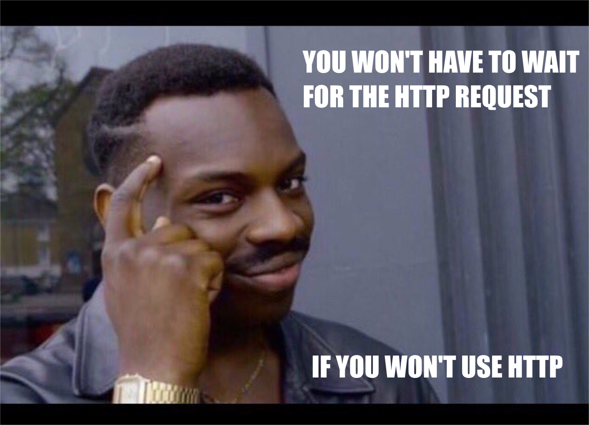

# Communication
<!-- .slide: data-background-image="https://s-media-cache-ak0.pinimg.com/originals/2f/ae/e1/2faee1afb1444950f14b8feea47620ff.jpg" -->

Well... Internet is about communication. <br />
Internet = communication. XD

---

#### Communication
# API

API = Application Programming Interface

API is nothing more than a method to access data and workflow from an application without using an application itself

it's like blackboxing - you're only interested about the input and the output and you don't care about how it works really
Note:
obrazek tutaj

## Sample?

 

 

Eg. Facebook without Like API and with Like API


---

How does that relate to Programming?

## Interfaces (in programming)

You remember MVC?

**Not only on backend!**

In API-based solutions: view is the API format.
Note:
Backend: M->C->V -----> M->C->V 

---

Imagine, how should we structure such API?

E.g. Facebook
User may want to:
- add post
- get posts on wall

## Exercise
Try to imagine how such API would work?

---

How do we use it?

 
Note: 
Przerobić obrazek


https://www.slideshare.net/jmusser/j-musser-apishotnotgluecon2012/43-API_Business_Models


---

#### Communication
# Keep it clean

How do we make sure that's not a mess?

# REST 
no, we won't xdd

REST = REpresentational State Transfer

## Level 1
Resources
- organize your data in endpoints

## Level 2
CRUD also known as HTTP verbs
- add methods to this endpoints

## Level 3
### HATEOAS (Hypermedia As The Engine Of Application State)
Note:
The principle is that a client interacts with a network application entirely through hypermedia provided dynamically by application servers.

---

#### Communication
# Common language

Why do we care?

<!-- .slide: data-background-image="https://s-media-cache-ak0.pinimg.com/originals/fe/30/43/fe3043cfe1e79d5bf858da5f62557ad8.gif" -->

It has to be structured!

## XML
```
<note>
<to>Tove</to>
<from>Jani</from>
<heading>Reminder</heading>
<body>Don't forget me this weekend!</body>
</note>
```

## JSON
```
{"menu": {
  "id": "file",
  "value": "File",
  "popup": {
    "menuitem": [
      {"value": "New", "onclick": "CreateNewDoc()"},
      {"value": "Open", "onclick": "OpenDoc()"},
      {"value": "Close", "onclick": "CloseDoc()"}
    ]
  }
}}
```

XML is old & Java-ish. <br />
JSON is new & JavaScript-ish.

Ok, but is one better then the other? Let's find out!

### Exercise for you
Research on "XML over JSON" and "JSON over XML" <br />
5 mins
<video src="http://i.imgur.com/dqEBR0r.webm"></video>


## Alternatives:
- MessagePack: super optimized


## Alternatives:
- YAML: XML with indentations
```
receipt:     Oz-Ware Purchase Invoice
date:        2007-08-06
customer:
    given:   Dorothy
    family:  Gale
```

---

#### Communication
# Structure
<!-- .slide: data-background-image="http://vignette3.wikia.nocookie.net/matrix/images/9/9c/Matrix_Code.gif/revision/latest/scale-to-width-down/800?cb=20110306191618" -->

As was said before: *programmers like to abstract*.

- Design Patterns
- Django
- Python
- C
- Assembly code 
- Machine code
- Maths, Logic, Physics...

There's something like ISO/OSI model. You remember that from uni? 
But why do we need it? Do we need it?

## ISO/OSI
- Please note that this is an incredible simplification!

### Physical layer...
is the postmen and their trucks - this is how the letters actually get from point A to point B. 

### Data link layer...
is the envelope - you can't just put a handwritten letter in a mailbox and expect it to be sent somewhere. 

### Network layer...
is the address on the envelope - the post needs to know where to deliver the letter. This establishes a connection between two residences. 

### Transport layer...
is a name on the envelope - once it gets inside your house, it needs to be given to the correct person. 

### Session layer...
is a standard letter format - this includes dating the letters, saying "dear so-and-so" and "yours truly." 

### Presentation layer...
is the body of the letter itself - let's make sure both parties are writing in English.

### Application layer...
is the collection of letters exchanged - the point of the previous six layers was to enable the pen pal relationship between two people. 


Note:
Metaphore with translation of the languages. Antek: "Lubie kroliki" => "I like Rabbits" => wyslij na maila do Stefana => sru mail => "I like Rabbits" => "J'aime les lapins"

<!-- .slide: data-background-image="http://i.imgur.com/qhnJO.gif" -->
## IT'S MODULAR!!!!1!!1
Note:
And applicable to all sorts of digital communication. Phones, owls, you name it.

## TCP/IP
- simplified version of ISO/OSI for the Internet
- just 4 layers


---

#### Communication
# Live

Take into consideration e.g. http://agar.io/
5 mins for playing :D

Ok, now how it's made?

## Basic scenario
- C -> S: Gimme sumfin [GET /sumfin]
- S -> C: OK, sure [200 OK]

## But...
This is impossible: <br />
S -> C: Hey man, I have sumfin for you! [?????]

HTTP is a client-server protocol. Client *requests* and server *responds*, never the other way around. <br />
Luckily, we can try to hack it.

### Hack number 1 - frequent requests
- C -> S: Hey man, u have sumfin for me? [GET /sumfin]
- S -> C: Nope [404 Not Found]
- (1 sec later)
- C -> S: Hey man, u have sumfin for me? [GET /sumfin]
- S -> C: Still nope [404 Not Found]
- (1 sec later)
- C -> S: Hey man, u have sumfin for me? [GET /sumfin]
- S -> C: OK, sure [200 OK]

### Hack number 2 - long polling
- C -> S: Hey man, if you'll have something for me just lemme know [GET /sumfin]
- S: (...)
- S -> C: Ok, here you are [200 OK]

But... both are not very efficient, right?

<!-- .slide: data-background-image="https://s-media-cache-ak0.pinimg.com/originals/a1/8e/f6/a18ef6865622b367bee21c0dfd2aebd0.gif" -->
## Introducing... WEBSOCKETS!!!!1!!1




Websockets aren't replacement for HTTP, they're more of an extension.

---

#### Communication
# Asynchronous?

## What is that word?


## An example for thinking.

## What is the single most important reason that we need this?

## When communicating, time of response is *nondeterministic*.

## Short excercise

Note: 
Ćwiczenie z onetu (20 min)

---

#### Communication
# Explore the API
