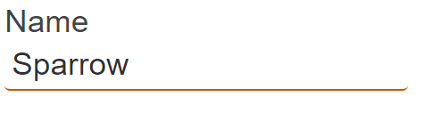
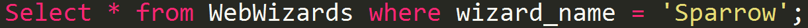
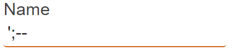
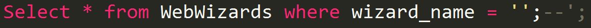
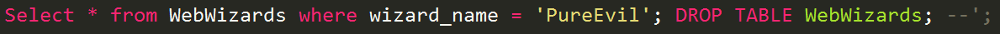
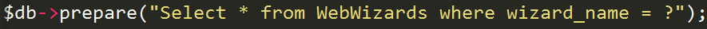
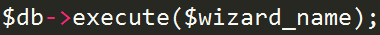
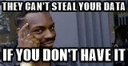

# Security
<!-- .slide: data-background-image="https://s-media-cache-ak0.pinimg.com/originals/2f/ae/e1/2faee1afb1444950f14b8feea47620ff.jpg" -->

---

#### Security
## A few thoughts

### Everyone makes mistakes!

### One about a few chars that brought Chrome down
https://www.youtube.com/watch?v=0fw5Cyh21TE

### LinkedIN
Note:
Cookies does not expires for a year! E.g. Banking cookies expires after 10-15 mins
They did not use a salt while creating checksums
May 2016 167 mln accounts of 117 mln users offered for sale 
passwords like “linkedin’, ‘hopeless,’ ‘killmenow’, ‘iwishiwasdead’, and ‘hatemyjob’ where proven to be used

### Massive Amazon cloud service outage disrupts sites
Note:
4 hours of problems, 28.02
Amazon Web Services is a giant provider of the back-end of the Internet. For sites like Netflix, Spotify, Pinterest and Buzzfeed, as well as tens of thousands of smaller sites, it provides cloud-based storage and web services for companies so they don’t have to build their own server farms,
Amazon wasn't able to update its health dashboard because it was hosted in their cloud :)
It was annual AWSome Day - free online training event that will provide a step-by-step introduction to the core AWS services for compute, storage, database and networking.
cause of that was a simple typo! Engeeners of S3 team were debugging the billing sysyem. They needed to take samall number of servers offline, but because of typo larger set of servers was removed. Some of the removed servers supported two other S3 subsystems. One of them was responsible for managing metadata and location information of all S3 objects in the region. Without it services taht depend on it couldnt perform basic data retrieval and storage tasks. After taking servers offline the various systems had to do a "full restart". Amazon claims that s3 (simple storage service) was design to handle losing a few servers. What it had more trouble with was handling the massive restart.

#### Security
# Best practices

<!-- .slide: data-background-image="https://s-media-cache-ak0.pinimg.com/originals/89/fa/06/89fa06b360359633a8d2f3887cd85fe1.jpg" -->

## Remember:
- Build your apps like you're being attacked, beacuse eventually you will be! <!-- .element: class="fragment" data-fragment-index="1" -->
- Never trust user input <!-- .element: class="fragment" data-fragment-index="2" -->
- Assume that anything sent to your website is malicious unless proven otherwise <!-- .element: class="fragment" data-fragment-index="3" -->
- Prepare for the worst <!-- .element: class="fragment" data-fragment-index="4" -->
- Think "How could I break this?" <!-- .element: class="fragment" data-fragment-index="5" -->

---

### Authentication and Authorization is not the same thing!!!
- (Authentication) Veryfying that a user provided their security credentials correctly
- (Authorization) Confirming that a particular user has access to a specific resource
Note:
1 authentication, 2 Authorization
https://dzone.com/articles/10-most-common-web-security-vulnerabilities

---

#### Security
# OWASP

### OWASP stands for Open Web Application Security Project
Note:
an international, non-profit organization whose goal is to improve software security across the globe.

## 1. Injection Flaws
Happens while passing unfiltered data
Note:
SQL injection, browser, LDAP server (katalogowanie)

### How SQL injection works

#### Input box

  
### Then in DB you get something like that 

#### Input box

  
### Then in DB you get something like that 

## Can you see the potential?

#### Input box
#### PureEvil'; DROP TABLE WebWizards; --
  
### Then in DB you get something like that 

<!-- .slide: data-background-image="md/8-security/atom_bomb.jpg" -->

## 1. Injection Flaws (Prevention)
- Filter and conquer
- Never use a blacklist - hard to create, easy to bypass
- Rely on framework's filtering functions
- Prepared statements

### Prepared statement
#### Simply seperate data and code

## 2. Broken Authentication 
- Today nobody roll their own authentication code because it is to hard
### Possible problems:
- The URL might contain the session ID and leak it in the referer header to someone else
- The passwords might not be encrypted either in storage or transit
- The session IDs might be predictable, thus gaining access is trivial
- Session fixation might be possible
- Session hijacking might be possible, timeouts not implemented right or using HTTP (no SSL)

## 2. Broken Authentication (Prevention)
- Again - use framework

## 3. Cross Site Scripting (XSS)
### In other words - input sanitazation failure
Note: 
An attacker gives your web application JavaScript tags on input. When this input is returned to the user unsanitized, the user's browser will execute it. It can be as simple as crafting a link and persuading a user to click it, or it can be something much more sinister. On page load, the script runs and, for example, can be used to post your cookies to the attacker

### One about a XSS security hole in Twitter
https://www.youtube.com/watch?v=zv0kZKC6GAM

## 3. Cross Site Scripting (XSS) (Prevention)
### DO NOT return HTML tags to the client
Note:
Usually, the workaround is simply converting all HTML entities—so that script is returned as <>script <>. The other often employed method of sanitization is using regular expressions to strip away HTML tags using regular expressions on < and >, but this is dangerous. A lot of browsers will interpret severely broken HTML just fine. Better to convert all characters to their escaped counterparts. 

## 4. Insecure Direct Object References
### Internal object such as a file or database key is exposed to the user

## 4. Insecure Direct Object References (Prevention)
- Perform user authorization properly and consistently
- Whitelist the choices
- store data internally and not rely on it being passed from the client via CGI parameters
- and use frameworks :)

## 5. Security Misconfiguration
- Running the application with debug enabled in production.
- Having directory listing enabled on the server, which leaks valuable information.
- Running outdated software (think WordPress plugins, old phpMyAdmin).
- Having unnecessary services running on the machine.
- Not changing default keys and passwords. (Happens way more frequently than you'd believe!)
- Revealing error-handling information to the attackers, such as stack traces.

## 5. Security Misconfiguration (Prevention)
- Good (preferably automated) "build and deploy" process, which run test on deploy

## 6. Sensitive Data Exposure
### Sensitive data should be encrypted at all times, including in transit and at rest
###  Credit card information and user passwords should never travel or be stored unencrypted, and passwords should always be hashed

## 6. Sensitive Data Exposure (Prevention)
- In transit: Use HTTPS with a proper certificate and PFS (Perfect Forward Secrecy). Do not accept anything over non-HTTPS connections. Have the secure flag on cookies.
- In storage: This is harder. First and foremost, you need to lower your exposure. If you don't need sensitive data, shred it.

## 7. Missing Function-Level Access Control 
- In other words an authorization failure

## 7. Missing Function-Level Access Control (Prevention)
On the server side, authorization must always be done! Always! I really mean always!

## 8. Cross Site Request Forgery (CSRF)
If you are logged in on one tab on your bank's homepage, for example, and they are vulnerable to this attack, another tab can make your browser misuse its credentials on the attacker's behalf, resulting in the confused deputy problem. The deputy is the browser that misuses its authority (session cookies) to do something the attacker instructs it to do.
Note:
Fun fact: CSRF is also the method people used for cookie-stuffing in the past until affiliates got wiser.

## 8. Cross Site Request Forgery (CSRF) (Prevention)
Store a secret token in a hidden form field which is inaccessible from the third-party site

## 9. Using Components With Known Vulnerabilities
Note:
The title says it all. Again, I'd classify this as more of a maintenance/deployment issue. Before incorporating new code, do some research, possibly some auditing. Using code that you got from a random person on GitHub or some forum might be very convenient, but is not without risk of serious web security vulnerability.
I have seen many instances, for example, where sites got owned (i.e., where an outsider gains administrative access to a system), not because the programmers were stupid, but because a third-party software remained unpatched for years in production. This is happening all the time with WordPress plugins, for example. If you think they will not find your hidden phpMyAdmin installation, let me introduce you to DirBuster.
The lesson here is that software development does not end when the application is deployed. There has to be documentation, tests, and plans on how to maintain and keep it updated, especially if it contains third-party or open-source components.

## 9. Using Components With Known Vulnerabilities (Prevention)
- do not be a copy-paste coder
- Stay up to date

## 10. Unvalidated Redirects and Forwards
- This is once again an input filtering issue
Note:
Suppose that the target site has a redirect.php module that takes a URL as a GETp parameter. Manipulating the parameter can create a URL on targetsite.comthat redirects the browser to malwareinstall.com. When the user sees the link, they will seetargetsite.com/blahblahblah, which the user thinks is trusted and is safe to click. Little do they know that this will actually transfer them onto a malware drop (or any other malicious) page. Alternatively, the attacker might redirect the browser to targetsite.com/deleteprofile?.

## 10. Unvalidated Redirects and Forwards (Prevention)
- Don't do redirects at all (they are seldom necessary)
- Have a static list of valid locations to redirect to
- Whitelist the user-defined parameter, but this can be tricky

---

<!-- .slide: data-background-image="https://media.tenor.co/images/36c122ea688493fd48c9b7b96d3ce3ef/tenor.gif" -->
## IN!